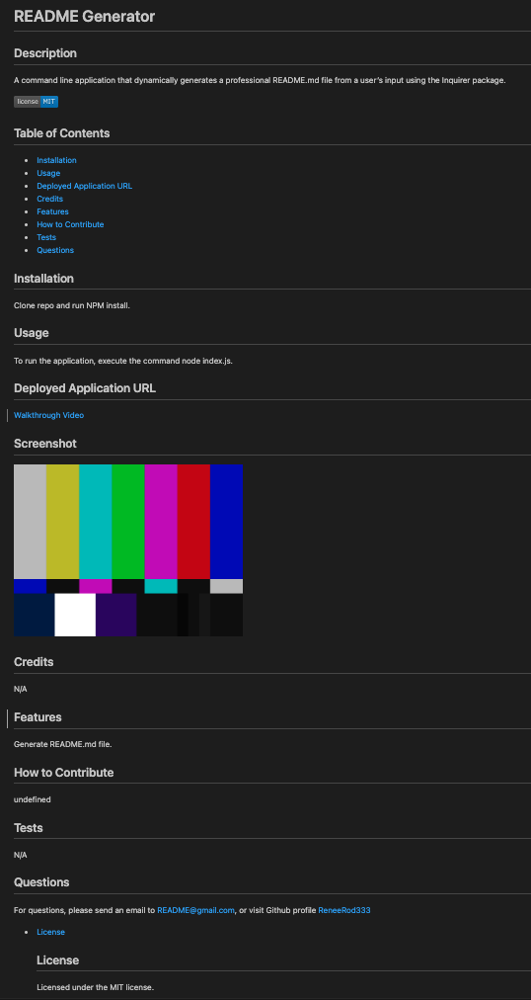

# README Generator

  ## Description
  A command line application that dynamically generates a professional README.md file from a user's input using the Inquirer package.
  
  

  ## Table of Contents
  * [Installation](#Installation)
  * [Usage](#Usage)
  * [Deployed Application URL](#Link)
  * [Credits](#Credits)
  * [Features](#Features)
  * [How to Contribute](#HowToContribute)
  * [Tests](#Tests)
  * [Questions](#Questions)
 
  ## Installation
  Clone repo and run NPM install.

  ## Usage
  To run the application, execute the command node index.js.

  ## Deployed Application URL
  [Walkthrough Video](./develop/videos/README-Generator.mov)

  ## Screenshot
  

  ## Credits
  N/A

  ## Features
  Generate README.md file.

  ## How to Contribute
  N/A

  ## Tests
  N/A

  ## Questions
  For questions, please send an email to <README@email.com>, or visit Github profile [ReneeRod333](https://github.com/ReneeRod333)

 
  
* [License](#license)

  ## License
    Licensed under the MIT license.

